# Training Management System (TMS) - Regulated Compliance Platform

A high-integrity Training Management System designed for regulated industries. This project integrates AI-driven assessment generation, automated compliance tracking, and a robust governance analytics layer.

---

## 🏗 High-Level Architecture

```mermaid
graph LR
    subgraph Client ["💻 USER INTERFACE"]
        direction TB
        React["React 18 + Vite"]
        TW["Tailwind CSS UI"]
        Framer["Framer Motion"]
    end

    subgraph API ["🚀 API GATEWAY"]
        direction TB
        Express["Express.js Server"]
        JWT["JWT Auth & Security"]
        Router["Modular Routing"]
    end

    subgraph Logic ["� BRAIN (AI & SERVICES)"]
        direction TB
        Groq["Groq AI Core"]
        Audit["Audit Log Engine"]
        Cert["PDF Cert Generator"]
        Gov["Governance AI"]
    end

    subgraph Persistence ["💾 DATA PERSISTENCE"]
        direction TB
        MDB[("MongoDB Atlas")]
        Redis[("App State Cache")]
    end

    Client -->|HTTPS/JSON| API
    API --> Logic
    Logic --> Persistence
    Logic -.->|AI Query| Groq

    %% Professional Styling
    classDef client_style fill:#f0f9ff,stroke:#0369a1,stroke-width:2px,color:#0369a1;
    classDef api_style fill:#fff7ed,stroke:#c2410c,stroke-width:2px,color:#c2410c;
    classDef logic_style fill:#f5f3ff,stroke:#6d28d9,stroke-width:2px,color:#6d28d9;
    classDef db_style fill:#f0fdf4,stroke:#15803d,stroke-width:2px,color:#15803d;

    class Client,React,TW,Framer client_style;
    class API,Express,JWT,Router api_style;
    class Logic,Audit,Cert,Gov,Groq logic_style;
    class Persistence,MDB,Redis db_style;
```



---

## 🔄 Core Workflows

### 1. Training & Assessment Workflow


### 2. Governance Analytics Workflow


---

## 🛠 Technology Stack

### Frontend
- **Framework**: React 18 + Vite
- **Styling**: Tailwind CSS (Modular Premium Design)
- **Icons**: Lucide React
- **Animations**: Framer Motion
- **Networking**: Axios

### Backend
- **Runtime**: Node.js + TypeScript
- **Framework**: Express.js
- **Database**: MongoDB (Mongoose ODM)
- **AI Engine**: Groq SDK (Llama 3.3 70B)
- **PDF Gen**: PDFKit
- **Logging**: Custom Audit Trial System

---

## 📁 Project Structure

```text
TMS/
├── frontend/             # React Application
│   ├── src/
│   │   ├── components/   # Reusable UI (AI Assistant, Notification, etc.)
│   │   ├── pages/        # Dashboard, Governance, Training Details, etc.
│   │   ├── services/     # API Integration
│   │   └── contexts/     # Auth Context
├── backend/              # Express API
│   ├── src/
│   │   ├── controllers/  # Business Logic (Assessments, Uploads, AI)
│   │   ├── models/       # Mongoose Schemas (User, TrainingRecord, etc.)
│   │   ├── routes/       # API Endpoints
│   │   ├── services/     # AI, Certificates, Audit Service
│   │   └── scripts/      # Maintenance & Utility Scripts
└── README.md             # Project Documentation
```

---

## 🚀 Setup & Installation

### Prerequisites
- Node.js (v16+)
- MongoDB (Local or Atlas)
- Groq API Key

### Backend Setup
1. `cd backend`
2. `npm install`
3. Create `.env` file from `.env.example`
4. `npm run dev`

### Frontend Setup
1. `cd frontend`
2. `npm install`
3. `npm run dev`

---

## 📜 Governance & Compliance
- **Read-Only Analytics**: AI Governance layer is strictly analytical.
- **Audit Trails**: Every lifecycle change is logged immutably.
- **Grading**: Standardized 3-tier system (FAIL < 35%, PASS 35-60%, EXCELLENT > 60%).

---
*AI Generated Documentation – Structured for Governance*
